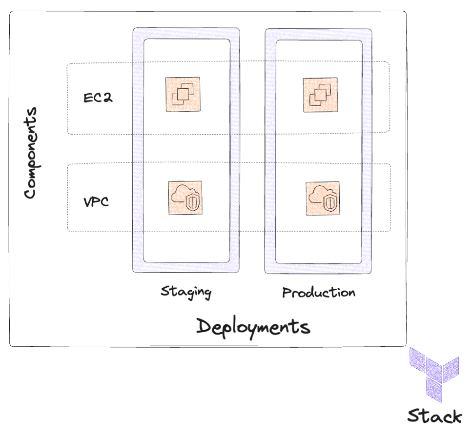

# webapp-aws-stack

_This is an example stack configuration for the private preview of Terraform Stacks. Language
constructs and features are subject to change given feedback received during this preview. Do not
use Stacks for production workloads at this time._

This stack provisions an AWS virtual private cloud (VPC) and EC2 instance with the latest Ubuntu AMI running a basic web application. The different deployments have minor differences between them including a different `aws_region` and `user_data` file, which creates a seperate application based on the inputs. 

Two components are used:

* `vpc` uses the popular AWS VPC Terraform module to provision an AWS virtual private network, with
  various subnets.
* `ec2` uses the created VPC's ID to fetch the subnets and provision an EC2 instance running Ubuntu
  within each. Initially, the planning of changes for this component will be _deferred_, and will be
  subsequently planned after the initial apply provisioning the `vpc` component infrastructure.

_We do not recommend using this example within production accounts. This example will incur [small]
costs if provisioned. Please remember to destroy the infrastructure after using this example._

## Usage

_Prerequisites: You must have a Terraform Cloud account with access to the private preview of
Terraform Stacks, a GitHub account, and an AWS account with Terraform Cloud configured as an OIDC
identity provider. Details of all of this are found in the provided Stacks User Guide._

1. **Configure AWS authentication** by creating a new IAM role in the AWS web console (or with
   Terraform itself!) with proper permissions (S3, Lambda, and API Gateway) and a trust policy to
   allow the role to be assumed by Terraform Cloud (the OIDC identity provider). More details on this
   step can be found in the Stacks User Guide.
2. **Fork this repository** to your own GitHub account, such that you can edit this stack configuration
   for your purposes.
3. **Edit your forked stack configuration** and change `deployments.tfdeploy.hcl` to use the ARN of the
   IAM role you created, as well as an audience value for OpenID Connect and the name of a key pair
   to use for the purposes of logging in to the created EC2 instances (import your own SSH public
   key in the AWS console under EC2 -> Key Pairs -> Import Key Pair)
4. **Create a new stack** in Terraform Cloud and connect it to your forked configuration repository.
5. **Provision away!** Once applied, look at the `public_ip` attribute for the
   one of the `aws_instance` resources. Using your local SSH key, you should be able to log in to
   the Ubuntu console for that instance via `ssh ubuntu@<public-ip-of-ec2-instance`.
